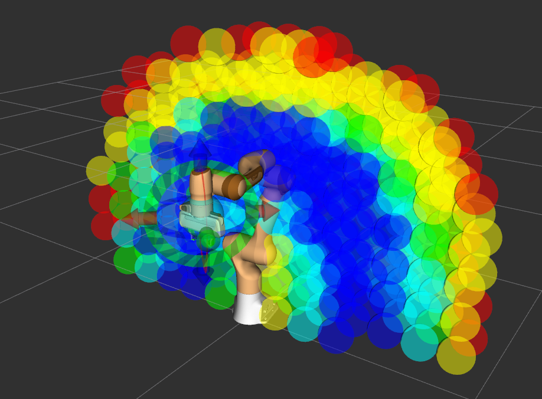
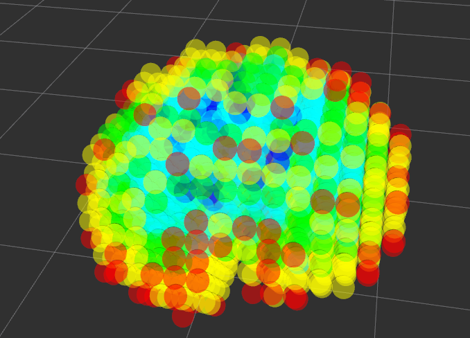
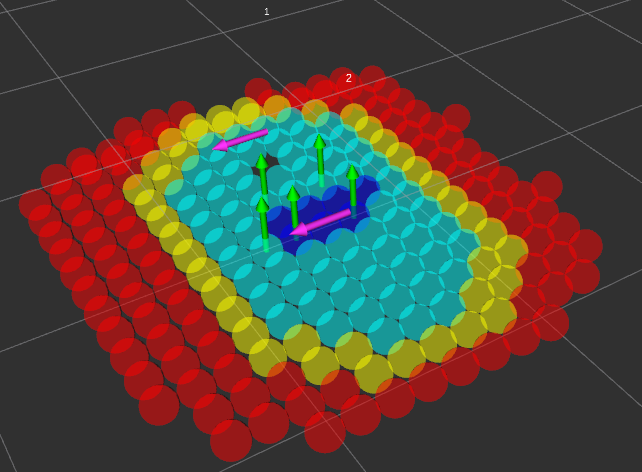

# reuleaux_moveit
---

## Overview
This version of Reauleaux creates reachability maps using the [MoveIt!](https://moveit.ros.org/) interface.
Allowing Reuleaux to create a map of redundant manipulators with self collision checking.

<!--  -->


Map generation performance has been significantly improved and now uses two complementary strategies that can be combined for maximum workspace sampling speed.

**Parallel IK solving** distributes the IK queries across multiple threads (controlled by `num_ik_threads` param), each operating on its own private copy of the robot model and planning scene. This alone gives a near-linear reduction in wall-clock time relative to the single-threaded original service based approach.

**Flood-fill workspace sampling** (`use_flood_fill:=true`, param) replaces the exhaustive sphere-by-sphere scan with a BFS that starts from the centre of the workspace and only expands into the neighbours of spheres that were found to be reachable. Because the unreachable fringe of the workspace is never evaluated, this reduces the number of IK queries by roughly 9x on typical manipulators.

Together these two improvements mean that, for example, a 0.025 m resolution Kinova map with a total workspace size of 2,255,127 spheres, previously took 100 days using a single core and service calls to MoveIt, but can now be generated in ~14 hours using flood fill and 20 cores, yielding a final workspace with 240,688 spheres and 3,790,266 reachable poses.

---

### License
`TBD`
This source code is released under the ... license.

---

## Installation
1. Follow the [installation instructions](https://ros-planning.github.io/moveit_tutorials/doc/getting_started/getting_started.html#create-a-catkin-workspace-and-download-moveit-source) for MoveIt! for ROS Noetic.

2. You will need an updated fork of the original [Reuleaux package](http://wiki.ros.org/reuleaux) to visualise maps, however you won't need to install OpenRAVE to build this.

Working in you catkin_ws/src directory...
```bash
git clone --branch noetic-devel https://github.com/MShields1986/reuleaux.git
```

3. Clone this package, again working in you catkin_ws/src directory...
```bash
git clone https://github.com/MShields1986/reuleaux_moveit.git
```

4. Update and install any dependencies...
```bash
sudo apt update
rosdep update
rosdep install -r -y --from-paths . --ignore-src
```

5. Build the project...
```bash
cd ..
catkin build --cmake-args -DCMAKE_BUILD_TYPE=Release
```

---

## Usage
A launch file is included that can be used with [the Panda arm demo](https://ros-planning.github.io/moveit_tutorials/doc/quickstart_in_rviz/quickstart_in_rviz_tutorial.html) that is bundled with MoveIt!

### Create a Reachability Map
Check the settings in [the launch file](https://github.com/MShields1986/reuleaux_moveit/blob/noetic-devel/map_generation/launch/panda_demo.launch) and then run...
```bash
roslaunch map_generation panda_demo.launch
```

Note that MoveIt! will throw a `Found empty JointState message` error for every pose solution (which is a lot), this is a [known issue](https://github.com/ros-planning/moveit/issues/659) and doesn't effect the generation of reachability maps.

### Map Generation Parameters

The following parameters can be passed as launch arguments to tune performance and IK strategy.

| Parameter | Default | Description |
|---|---|---|
| `num_ik_threads` | `20` | Number of parallel threads used for IK. Each thread owns its own copy of the robot model and planning scene, so there is no lock contention. Set this to the number of logical CPU cores available for best performance. **Ignored when `use_service_ik:=true`.** |
| `num_ik_attempts` | `1` | Maximum number of IK solve attempts per end-effector pose. The first attempt uses the current joint state as the seed. Subsequent attempts randomise the seed, which helps find collision-free solutions for kinematically redundant robots at the cost of extra computation time. A value of `1` is fastest and sufficient for most non-redundant arms. **Ignored when `use_service_ik:=true`.** |
| `use_service_ik` | `false` | When `true`, IK is queried via the `/compute_ik` ROS service (serial, single-threaded). This is slower but can be useful for debugging or for robots whose IK plugin only exposes a service interface. When `false` (the default), MoveIt's `setFromIK` is called directly inside the worker threads, which is significantly faster. |
| `use_flood_fill` | `true` | When `true`, workspace sampling uses a BFS flood-fill that starts from the centre of the workspace and only evaluates IK for the neighbours of already-reachable spheres. This skips large unreachable regions and gives approximately a 9× speed-up over the exhaustive scan. If no reachable spheres are found in the initial seed slice, the algorithm automatically falls back to the exhaustive mode. |

Example — generate a map using 8 threads with 3 IK attempts per pose:
```bash
roslaunch map_generation panda_demo.launch num_ik_threads:=8 num_ik_attempts:=3
```

### Visualise an Existing Reachability Map
To load an existing reachability map...
```bash
roslaunch map_generation panda_demo.launch create_map:=false
```

Note that the map to be loaded is currently not parameterised, so needs to be changed in [the launch file](https://github.com/MShields1986/reuleaux_moveit/blob/noetic-devel/map_generation/launch/panda_demo.launch) itself. The default is to load `map_generation/maps/panda_arm_0.05_reachability.h5`



### Inverse Reachability Maps
Inverse reachability maps can be created using [Reuleaux](http://wiki.ros.org/reuleaux#Inverse_Reachability_Map).
```bash
# The command takes the form of...
# rosrun map_creator create_inverse_reachability_map path_to/input_reachability_map.h5 path_to/output_inverse_map.h5

# For example
roscd map_generation/maps/

rosrun map_creator create_inverse_reachability_map panda_panda_arm_0.05_reachability.h5 ../../../reuleaux_moveit/map_generation/maps/panda_panda_arm_0.05_inverse_reachability.h5
```

### Visualise an Existing Inverse Reachability Map
To load an existing inverse reachability map...
```bash
roslaunch map_generation panda_demo.launch load_manipulator:=false create_map:=false
```

Note that the map to be loaded is currently not parameterised, so needs to be changed in [the launch file](https://github.com/MShields1986/reuleaux_moveit/blob/noetic-devel/map_generation/launch/panda_demo.launch) itself. The default is to load `map_generation/maps/panda_arm_0.05_inverse_reachability.h5`



### Use an Inverse Reachability Map for Finding Base Positions
This is done via the Reuleaux base_placement_plugin for RViz, which can be launched using...
```bash
roslaunch map_generation panda_demo.launch create_map:=false base_placement:=true
```

Then follow the [Reuleaux Wiki](http://wiki.ros.org/reuleaux) steps for loading the inverse reachability map etc.



---

## Bugs and Feature Requests
Please report bugs and request features using the [issue tracker](https://github.com/jontromanab/reuleaux_moveit/issues).
